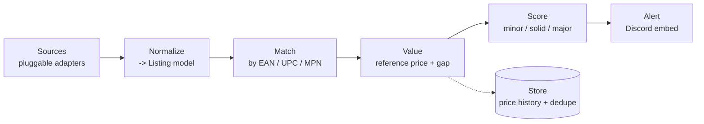

# PriceSniper

A cross-platform tech-deal detector. It watches retailers for **price gaps** and
**markdowns** on barcoded tech (Apple gear, GPUs, RAM kits, peripherals), scores
how good each opportunity is, and — later — alerts you on Discord.

> **Status:** `v0.1` · early, active development. This is a learning + portfolio
> project built in the open. Every significant decision is written up as an
> [Architecture Decision Record](docs/adr/) and the plan lives in
> [ROADMAP.md](ROADMAP.md).

## What it does (and how)

The system is a pipeline. Each stage has one job and speaks a shared data model,
so a source can be swapped, added, or moved from EU to US without touching the
logic downstream.



Everything from **Normalize** onward is region-agnostic. Going from EU to US
means writing new **Source** adapters — not rewriting the pipeline. That single
design choice is the backbone of the project; see
[ADR-0001](docs/adr/0001-pluggable-source-adapters.md).

## Quickstart

This project is managed with [uv](https://docs.astral.sh/uv/) (think `npm`, but
for Python). No global Python setup or manual virtual-environment juggling
needed — uv handles it.

```bash
# 1. Install uv (see the uv site for your OS one-liner), then:
uv sync            # creates the virtual env and installs dependencies (like `npm install`)
uv run pricesniper # runs the demo pipeline (like `npm run`)
```

You should see it scan the built-in demo listings and print the deals it found:

```
PriceSniper v0.1 - scanned 4 listings from 'demo' (EU)
Found 2 deal(s):

1. [SOLID]  Corsair Vengeance 32GB DDR5-6000
    EUR 184.00  (ref EUR 259.00)  ->  save EUR 75.00 / 29%
    marked down from original price - Azerty.nl - EU
    ...
```

Run the tests with `uv run pytest`.

## Project layout

```
src/pricesniper/
  models.py          # the shared data model: Listing, Deal, enums
  matching.py        # stage 2 — group listings by barcode/identity
  valuation.py       # stages 3 & 4 — reference price, gap, priority score
  sources/
    base.py          # SourceAdapter — the interface every source implements
    demo.py          # a fake source so it runs with zero setup
  __main__.py        # entry point wiring the pipeline together
tests/               # pytest sanity checks
docs/
  architecture.md    # the deeper "how it fits together" write-up
  adr/               # Architecture Decision Records — the "why" behind choices
```

## Tech choices (short version)

- **Python** — scraping, bots, and data pipelines are its home turf.
- **Pydantic** — runtime-validated models, so bad data fails loudly and early.
- **httpx + selectolax** — HTTP client and fast HTML parser for real adapters.
- **uv** — fast, npm-like project + dependency management.
- **ruff + pytest** — linting/formatting and tests.

The reasoning behind each is recorded in [docs/adr/](docs/adr/).

## Cross-platform notes

Built to move cleanly between Windows and macOS/Linux:

- `.gitattributes` normalizes line endings to `LF`, so switching machines does
  not produce noisy diffs.
- File paths use `pathlib` (never hand-built strings), so separators are correct
  on every OS.
- The virtual environment (`.venv/`) is gitignored and rebuilt per machine with
  `uv sync` — the same pattern as not committing `node_modules`.

## Scope & ethics

A personal, educational project. It is **alert-only**: it surfaces information a
human then acts on. It does **not** auto-purchase, and it stores **no** account
credentials. Real adapters should respect each site's terms of service and
`robots.txt`, prefer official feeds/APIs where they exist, and rate-limit
politely.
